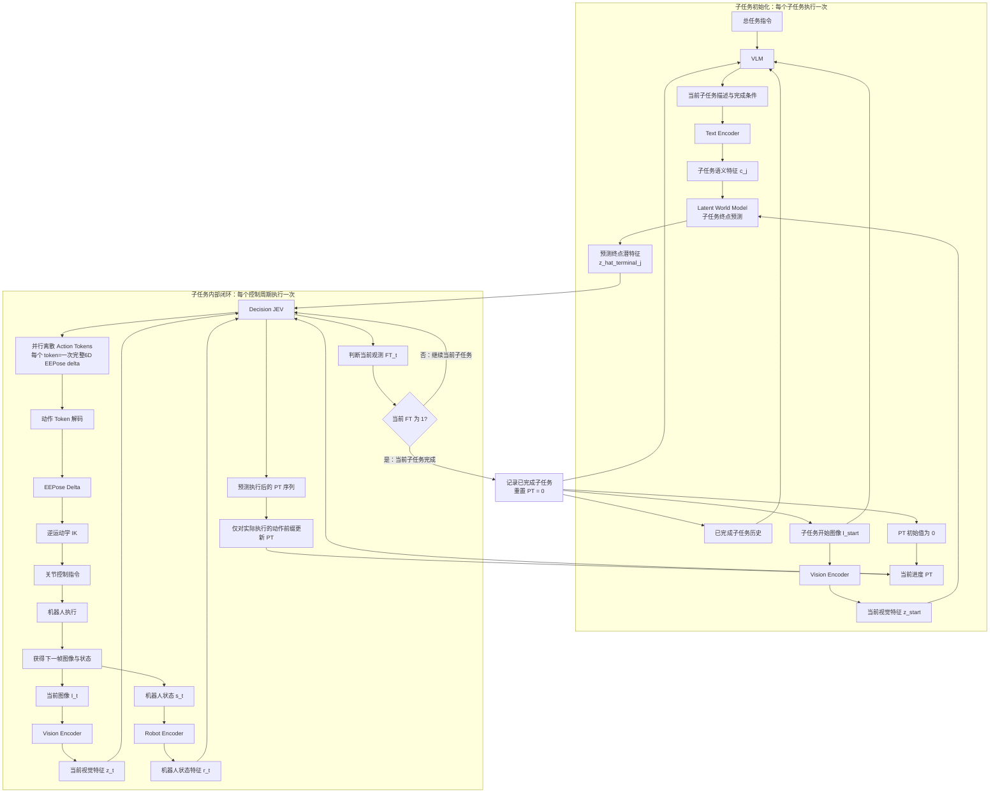
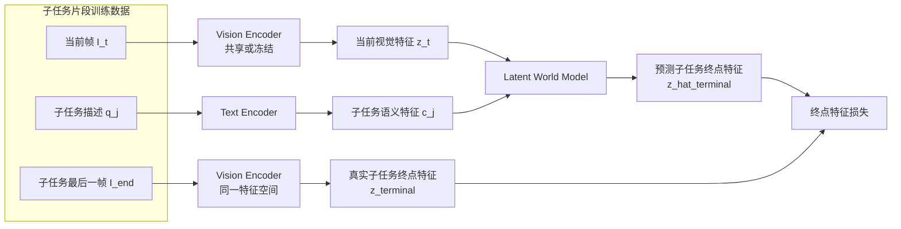
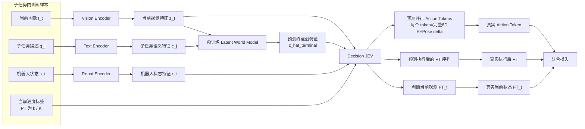

# Latent VLA JEV 流程图

这份文档包含三张可编辑的 Mermaid 流程图：

1. 在线推理主流程：VLM 在子任务边界调用，Decision JEV 在子任务内部循环控制。
2. Stage 1 训练流程：Latent World Model 预测子任务终点潜特征。
3. Stage 2 训练流程：Decision JEV 根据当前状态、终点潜特征和 PT 预测动作、执行后 PT，并判断当前观测是否完成（FT）。

对应的 Mermaid 源文件位于 [`flowcharts/`](flowcharts/)。

## 1. 在线推理主流程

## 2. Stage 1：Latent World Model 训练流程

## 3. Stage 2：Decision JEV 训练流程

