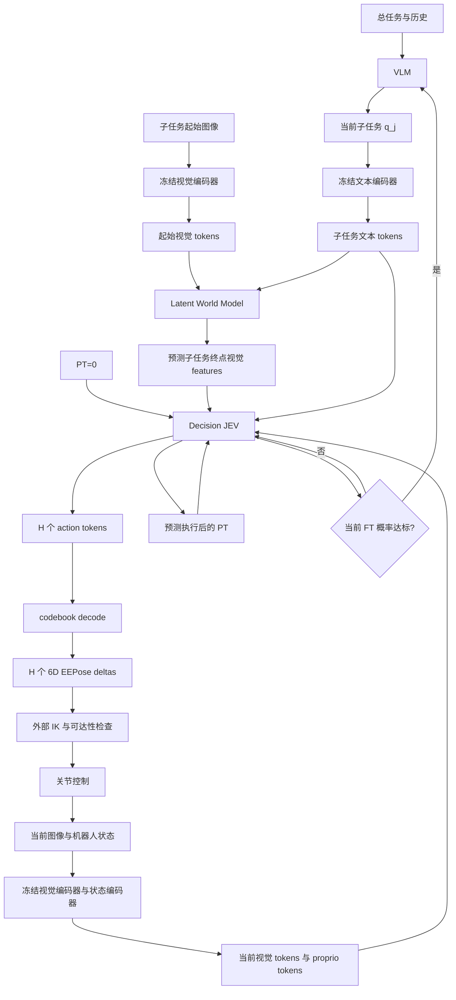

# Latent VLA：LWM、Decision JEV 与 Whole-Action Codebook

这份文档对应 `decision_jev/` 的第一版实现，并说明它如何和仓库中的
[`latent_world_model/`](../latent_world_model/) 连接。实现面向“一个离散 token
表示一次完整的 6D EEPose 增量”的控制方案。

## 1. 总体职责

系统把一个长任务分成 VLM 生成的子任务。VLM 只在子任务边界运行；子任务内部
由 JEV 进行短时域闭环控制。



各模块的边界如下。

| 模块 | 输入 | 输出 | 是否预测动作 |
|---|---|---|---|
| LWM | 子任务起始视觉 tokens、子任务文本 tokens | 子任务结束时的视觉 feature tokens | 否 |
| Decision JEV | 当前视觉、LWM 终点 features、文本、proprio、PT | 并行 action token logits、PT、当前 FT | 是 |
| Codebook | 训练集的物理 6D deltas | token ↔ 6D delta 的固定映射 | 否 |

## 2. Latent World Model

LWM 代码位于 `latent_world_model/src/lwm/`。当前实现是终点特征预测器：

\[
 Z_t=E_v(I_t),\quad C_j=E_q(q_j),\quad
 \hat Z_{end}=F_\theta(Z_t,C_j).
\]

`Z_t` 和 `\hat Z_end` 都保持视觉编码器的空间 token 布局 `[B,N,D_v]`。训练目标
是使用同一个冻结视觉编码器获得的成功终点特征 `Z_end`，而不是重建像素：

\[
 \mathcal L_{LWM}=\mathcal L_{cos}(\hat Z_{end},Z_{end})
 +\lambda\mathcal L_{smooth\text{-}L1}(\hat Z_{end},Z_{end}).
\]

LWM 不输入 PT、FT 或动作，也不负责判断完成。JEV 训练和部署使用 LWM 预测的
终点特征；使用真实终点特征只能作为 oracle ablation。缓存中的
`terminal_source`、`lwm_checkpoint` 和 encoder identity 用于避免把不同特征空间
混在一起。

成功终点必须由数据集确认。失败、超时和截断片段不能仅因为“录制的最后一帧”
就标记成成功终点。

## 3. Decision JEV

### 3.1 输入与主干

`DecisionJEV` 在 `src/jev/model.py` 中实现。每个控制周期输入：

```text
current_features : [B, N, Dv]
terminal_features : [B, N, Dv]   # LWM 预测的终点 features
task_features    : [B, L, Dt]
task_mask        : [B, L] bool   # True 表示有效文本 token
proprio          : [B, Ds]
progress         : [B]           # 当前 PT，范围 [0, 1]
```

当前视觉和终点视觉使用不同的 role embedding，但保持相同的空间布局；文本、
proprio 和 PT 作为另外三类条件 token。共享的双向 Transformer context encoder
融合这些 token，随后由固定的 action query slots 并行读取 context。

默认配置是：

```text
hidden_dim = 256
context_layers = 4
decoder_layers = 2
horizon = 4
codebook_size = 1024
```

JEV 不生成自由文本，也不使用自回归语言 decoder。一次前向的输出为：

```text
action_logits       [B, H, K]   # K 个完整 6D 动作 token
progress            [B, H]      # 执行每个预测动作后的 PT
completion_logits   [B]         # 当前观测状态的 FT logit
gripper_logits      [B, H, G]   # 可选，默认 0=hold, 1=open, 2=close
```

`completion_logits` 明确表示当前观测是否已经完成，不能由 PT 阈值硬推导。执行
动作块时只执行前 1～2 步，随后重新观测和规划；如果 FT 达到验证集调好的阈值，
必须清空剩余动作并把子任务交回 VLM。

### 3.2 PT、FT 的标签

成功子任务长度为 `T` 时，状态 `t` 的 PT 标签是：

\[
 PT_t=t/T.
\]

模型输入当前 `PT_t`，监督 `progress[h]` 为执行第 `h+1` 个动作后状态的 PT。
这避免把输入 PT 原样复制当成预测目标。失败片段不知道真实成功终点时，其
action/progress 监督全部 mask 掉，但最后状态仍可提供 `FT=0` 负例。

损失实现于 `src/jev/losses.py`：

\[
 \mathcal L=\mathcal L_{action}
 +\lambda_p\mathcal L_{PT}
 +\lambda_f\mathcal L_{FT}
 +\lambda_g\mathcal L_{gripper}.
\]

动作使用距离感知的 soft categorical target，PT 使用 Smooth-L1，FT 使用带
`pos_weight` 的 BCE-with-logits。所有 padding action 都由 `action_mask` 排除。

## 4. Whole-Action Codebook

### 4.1 Token 的物理含义

每个动作样本是一个完整向量：

\[
 a_t=[\Delta x,\Delta y,\Delta z,\Delta r_x,\Delta r_y,\Delta r_z].
\]

旋转部分是 rotation vector（弧度），不是 Euler 角差。codebook 为：

\[
 \mathcal C=\{c_0,\ldots,c_{K-1}\},\qquad c_k\in\mathbb R^6.
\]

因此 JEV 输出 `[k_t,k_{t+1},k_{t+2},k_{t+3}]` 时，四个 token 就是四个控制
时刻的完整 EEPose delta，而不是六个维度的六组 token，也不是 FAST 的频域系数。

`WholeActionCodebook` 位于 `src/jev/codebook.py`，默认 `K=1024`，也支持 512
或 2048。它使用：

1. 只用训练集成功示范动作拟合；
2. 平移和 rotation-vector 分别用训练数据的绝对 q99 尺度归一化，不裁剪异常动作；
3. 固定 `token 0` 为精确零动作；
4. 对归一化的完整 6D 向量执行 CPU K-Means++/Lloyd；
5. 训练、验证和部署固定同一 codebook、尺度、控制周期和 body/world frame。

均匀 6D 网格不推荐：512 的六次根只有约 2.8，每个维度几乎没有精度。完整
向量聚类可以学习平移和旋转之间的真实耦合。

### 4.2 Soft action target

最近 token 是：

\[
 k^*=\arg\min_k\|\tilde a-c_k\|_2^2.
\]

训练时只在最近的 `top_k` 个 code 上构造 soft label：

\[
 q_k=\frac{\exp(-d_k^2/(2\tau^2))}
 {\sum_{j\in\mathcal N}\exp(-d_j^2/(2\tau^2))},\quad k\in\mathcal N.
\]

默认使用 `top_k=8`、`temperature=0.1` 和 `hard_weight=0.25`：

\[
 y=(1-\alpha)q+\alpha\,onehot(k^*).
\]

这让物理上接近的动作获得相似监督，同时保留对最近中心的明确偏好。`K=1024`
是首选实验点；`K=512` 作为低延迟基线，`K=2048` 只有在数据量足够且 dead-code
比例可接受时才使用。选择 K 要依据以下验证指标，而不是只看词表大小：

- 平移和旋转重建 RMSE/P95；
- rotation geodesic error；
- codebook usage、dead codes、perplexity；
- 解码动作的 IK 可解率；
- 闭环任务成功率、动作平滑度和策略延迟。

推理默认 `argmax` 后查表，不直接计算 `sum_k p_k c_k`；相反方向的两个动作
平均后会产生危险的近零动作。夹爪使用独立的 3 类 head，不占用 6D codebook。

### 4.3 位姿组合和 IK

`src/jev/geometry.py` 提供 body/world frame 的 SE(3) 旋转向量组合。它只负责
把 delta 组合为目标 EEPose，不包含任何机器人型号的 IK。真实控制端必须：

1. 使用当前测量的 EEPose，而不是长期累加的预测 pose；
2. 选择与 codebook 一致的 body/world frame；
3. 调用机器人专用 IK；
4. 检查关节限位、碰撞和可达性后才发送关节命令。

## 5. 训练数据与命令

缓存是一个 `.pt` 字典：

```text
{
  "metadata": {
    "feature_contract": "terminal_conditioned_jev_v1",
    "vision_encoder": "...",
    "text_encoder": "...",
    "control_dt": 0.1,
    "action_frame": "body",
    "terminal_source": "predicted" | "oracle",
    "lwm_checkpoint": "..."       # predicted 时必须存在
  },
  "episodes": [
    {
      "episode_id": "...",
      "subtask_id": "...",
      "success": true,
      "current_features": [T+1,N,Dv],
      "terminal_features": [N,Dv],
      "task_features": [L,Dt],
      "task_mask": [L] bool,
      "proprio": [T+1,Ds],
      "actions": [T,6],
      "gripper_targets": [T] long       # optional
    }
  ]
}
```

`SubtaskDataset` 只在同一子任务内建立最长 `H` 步的 chunk，永远不会把下一个
子任务的动作拼进当前样本。训练/验证按完整 `episode_id` 隔离。

在 `decision_jev/` 目录安装后，可执行：

```bash
pip install -e '.[dev]'

# 生成仅用于软件 smoke test 的 toy cache
python scripts/make_toy_cache.py runs/toy/train.pt --episodes 192 --seed 7 --episode-prefix train
python scripts/make_toy_cache.py runs/toy/val.pt   --episodes 128 --seed 8 --episode-prefix val

# 仅使用 train cache 的成功动作拟合 codebook
jev fit-codebook runs/toy/train.pt runs/toy/codebook.pt --size 1024
jev evaluate runs/toy/val.pt runs/toy/codebook.pt

# 训练 JEV（真实实验中建议显式传入 train-only codebook）
jev train runs/toy/train.pt runs/toy/val.pt runs/toy/jev.pt \\
  --codebook runs/toy/codebook.pt --codebook-size 1024 \\
  --horizon 4 --epochs 50 --batch-size 32
```

toy 数据只检查张量契约和代码路径，不代表机器人性能。当前仓库环境缺少
PyTorch 时只能运行 `python -m compileall`；有 PyTorch 的训练机上再运行：

```bash
pytest -q
```

## 6. 推理时的最小接口

```python
from jev.checkpoint import load_policy
from jev.policy import SubtaskController

model, codebook, metadata = load_policy("jev.pt")
controller = SubtaskController(model, codebook, execution_horizon=1)
controller.begin_subtask(z_start, task_tokens, task_mask, lwm=lwm)

plan = controller.plan(z_current, proprio)
# plan.deltas -> 外部 IK；执行成功后：
controller.acknowledge(plan.plan_id, executed_steps=1)
```

`SubtaskController` 不连接机器人、不发送关节命令，也不把 FT 当作 PT 的阈值。
它只管理 LWM 终点缓存、短动作前缀、PT 更新和 FT 后的动作队列清空；机器人
驱动、IK、安全检查与 VLM 调用由上层系统负责。

## 7. 研究对照实验

实现完成后建议至少比较：

1. 当前视觉 + proprio；
2. 加 LWM 终点 features；
3. 再加 PT；
4. joint codebook `K=512/1024/2048`；
5. hard label 与 `top_k` soft label；
6. oracle terminal features 与 predicted terminal features；
7. 单步、预测 4 步执行 1 步、预测 8 步执行 2 步；
8. whole-action VQ 与每维均匀 bins/FAST-DCT 的动作重建及闭环性能。

这些实验可以区分 codebook 表示能力、LWM 预测误差和 JEV 控制误差，避免把
终点预测能力误认为动作策略能力。
